# Ozone Bootcamp

## SCM

21 January 2025

| **Timings** | **Topic** |
| --- | --- |
| 09:30 - 10:00 | Initialization and Start Up |
| 10:00 - 10:30 | SCM Architecture |
| 10:30 - 11:00 | Node Lifecycle |
| 11:00 - 11:15 | Break |
| 11:15 - 11:30 | Pipeline Lifecycle |
| 11:30 - 11:45 | Container Lifecycle |
| 11:45 - 12:00 | Block Management |
| 12:00 - 12:30 | Safemode |
| 12:30 - 12:45 | Disk Layout |
| 12:45 - 13:45 | Lunch |
| 13:45 - 14:00 | High Availability |
| 14:00 - 14:15 | Decommissioning |
| 14:15 - 14:45 | Recover from two SCM failure |
| 14:45 - 15:15 | Datanode Heartbeat Protocol |
| 15:15 - 15:30 | Break |
| 15:30 - 16:00 | Container Replication |
| 16:00 - 16:30 | Container Balancer |
| 16:30 - 17:00 | Q & A |

# Initialization and Start Up

### SCM Initialization

- Why initialization?
- What happens if we don’t initialize?
    - Start SCM Without init

    ```bash
    ozone scm
    ```

- SCM initialization overview

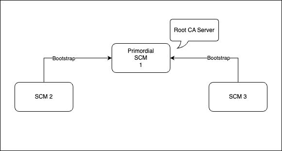

- What is Primordial SCM?
    - Why do we need it?
        - Root Certificate to have chain of trust
        - Cluster ID Generation
- init vs bootstrap

### Exercise

- Run init on non-primordial SCM

    ```bash
    ozone scm --init
    ```

- Run bootstrap on primordial SCM

    ```bash
    ozone scm --bootstrap
    ```

- Run init on primordial SCM

    ```bash
    ozone scm --init
    ```

- Run bootstrap on non-primordial SCM without primordial SCM running

    ```bash
    ozone scm --bootstrap
    ```

- Start primordial SCM

    ```bash
    ozone --daemon start scm
    ```

- Run bootstrap on non-primordial SCM (with primordial SCM running)

    ```bash
    ozone scm --bootstrap
    ```

- Start non-primordial SCMs

    ```bash
    ozone --daemon start scm
    ```

- Start the datanodes

    ```bash
    ozone --daemon start datanode
    ```


Check the SCM service

```bash
ozone admin scm roles
```

The datanodes should get registered in SCMs

```bash
ozone admin datanode list
```

[http://127.0.0.1:9876/](http://127.0.0.1:9876/)

## OM Initialization

- How is it different from SCM initialization?
- init vs bootstrap on OM
- Initialize OM nodes

    ```bash
    ozone om --init
    ```

- Start OM service

    ```bash
    ozone --daemon start om
    ```


- Check the status

    ```bash
    ozone admin om roles
    ```

    [http://127.0.0.1:9874/](http://127.0.0.1:9874/)


## Problem

In a healthy cluster, the scm db directory and metadata directory got corrupted (or got deleted) on the primordial SCM.

The SCM process will crash.

What will happen during restart?

What will be the behaviour in CM deployed Ozone?

How to fix and make the cluster healthy?

# SCM Architecture

What does SCM manage?

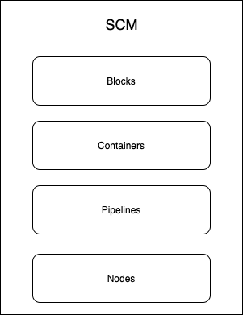

How does it manage?

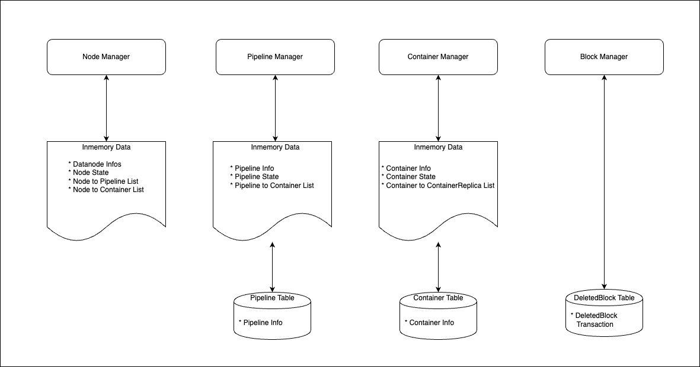

# Metadata

### SCM RocksDB Tables

Pipeline Table

```bash
ozone debug ldb --db=/data/metadata/scm.db value-schema --cf=pipelines | jq '.Pipeline |  keys'
```

Container Table

```bash
ozone debug ldb --db=/data/metadata/scm.db value-schema --cf=containers | jq '.ContainerInfo |  keys'
```

Deleted Blocks Table

```bash
ozone debug ldb --db=/data/metadata/scm.db value-schema --cf=deletedBlocks | jq '.DeletedBlocksTransaction |  keys'
```

## Viewing in-memory data vs data stored in the scm db

To view the metadata, we have to generate some first.

```bash
ozone sh volume create /vol
ozone sh bucket create /vol/buck
ozone sh key put /vol/buck/CONTRIBUTING.md  CONTRIBUTING.md
ozone sh key list /vol/buck
ozone sh key cat /vol/buck/CONTRIBUTING.md
```

Let’s query and check the metadata now

### Pipeline Information

In-Memory

```bash
ozone admin pipeline list
```

In Database

```bash
ozone debug ldb --db=/data/metadata/scm.db scan --cf=pipelines
```

### Container Information

In-Memory

```bash
ozone admin container list
```

In Database

```bash
ozone debug ldb --db=/data/metadata/scm.db scan --cf=containers
```

Why is there no data in the db?

### Node Information

We don’t store node information in db

In-Memory

```bash
ozone admin datanode list
```

### Block Information

We only store deleted block information until it’s purged. We don’t cache this information in-memory

```bash
ozone debug ldb --db=/data/metadata/scm.db scan --cf=deletedBlocks
```

### Problem

Write a key into the cluster and delete it. It should now be present in `deletedBlocks` table.

Query and check the entry in the table.

([https://issues.apache.org/jira/browse/HDDS-11643](https://issues.apache.org/jira/browse/HDDS-11643))

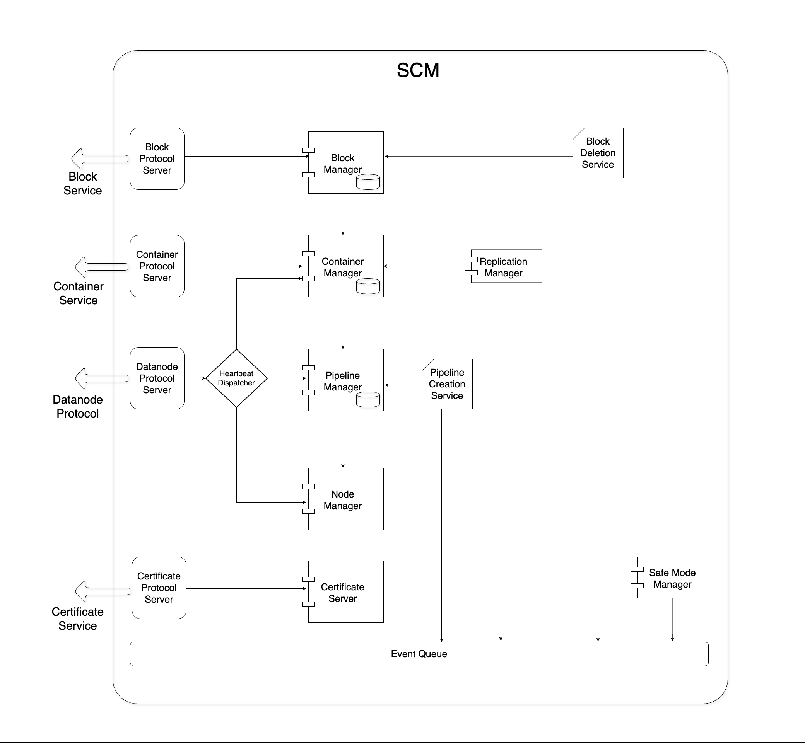

## End Points

Block Protocol Server

```bash
curl -s http://127.0.0.1:9876/jmx | grep -B3 -A 32 ScmBlockLocationProtocolService
```

Container Protocol Server

```bash
curl -s http://127.0.0.1:9876/jmx | grep -B3 -A 32 StorageContainerLocationProtocolService
```

Datanode Protocol Server

```bash
curl -s http://127.0.0.1:9876/jmx | grep -B3 -A 32 StorageContainerDatanodeProtocolService
```

Certificate Server

```bash
curl -s http://127.0.0.1:9876/jmx | grep -B3 -A 32 SCMSecurityProtocolService
```

[http://127.0.0.1:9876/#!/metrics/rpc](http://127.0.0.1:9876/#!/metrics/rpc)

## Services

Pipeline Creator Service

```bash
jstack <scm pid> | grep BackgroundPipelineCreator
```

Replication Manager

```bash
jstack <scm pid> | grep ReplicationManager
```

Block Deletion Service

```bash
jstack <scm pid> | grep SCMBlockDeletingService
```

# Node Lifecycle

## Node State Transition
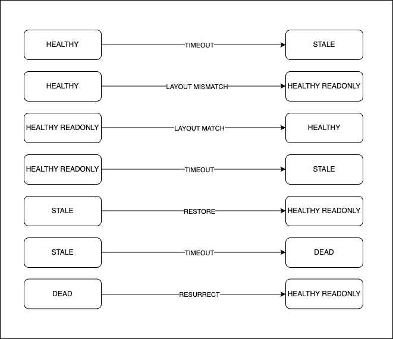

## Node State Flow
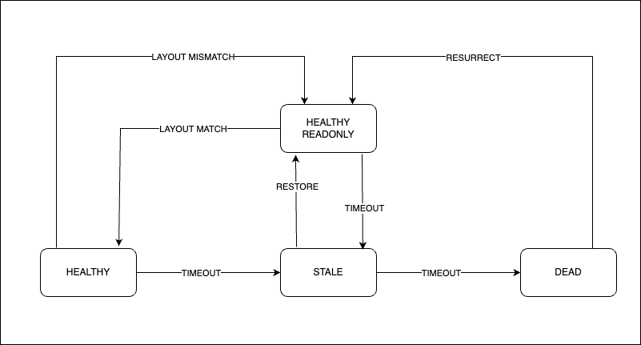

### Note
This setup has the following configuration changes
```bash
ozone.scm.stale.node.interval is 1m
ozone.scm.dead.node.interval is 2m
```
You can check the configs in http://127.0.0.1:9876/#!/config


- What is `HEALTHY_READONLY` state?
    - Used during upgrade
    - The datanodes are moved to this state when SCM is finalized but the datanodes are yet to be finalized.

- What happens when a datanode is marked as stale?
- What happens when a datanode is marked as dead?


## Exercise
Putting Datanode into `HEALTHY_READONLY` state.

Run the datanode list command to check the current state of the datanode
```bash
ozone admin datanode list
```
Stop the datanode process and manually modify the `layoutVersion` in the `VERSION` file
```bash
ozone --daemon stop datanode
vi /data/metadata/dnlayoutversion/VERSION
ozone --daemon start datanode
```

Run the datanode list command to check the current state of the datanode
```bash
ozone admin datanode list
```

Check if the upgrade finalization code was executed
```bash
grep -i finalize /var/log/hadoop/ozone-hadoop-datanode*.log
```

If a datanode is stuck in `HEALTHY_READONLY` state, it means that the datanode is not able to run upgrade finalization.
Check the datanode logs for more details.


### What is `Operational State`?
- IN_SERVICE
- ENTERING_MAINTENANCE
- IN_MAINTENANCE
- DECOMMISSIONING
- DECOMMISSIONED

Operational State along with Health State will give the overall state of the datanode.

# Pipeline Lifecycle

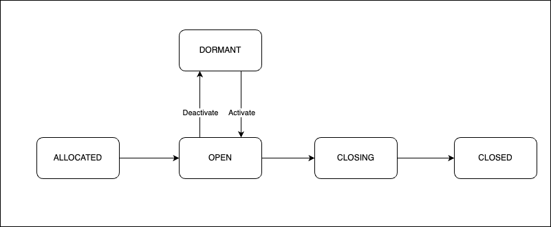

Types of Pipelines
- Ratis
- EC
- Standalone

Standalone Pipeline is used for reads (on Ratis Containers).

Pipelines creation is a costly operation, so they are created in background and are reused.

Pipeline will be closed only if
- there is a write failure on the Pipeline.
- there is a slow follower in the Pipeline Ratis group.
- one of the datanode in the pipeline is marked as stale.
- the pipeline close command is executed by admin.

### Pipeline Creation Flow
- Based on the Rack Awareness logic, the datanodes are picked for the Pipeline creation
- The Pipeline is created on SCM and it's moved to `ALLOCATED` state
- The SCM will send the Pipeline creation request to the datanodes that are part of the pipeline
- The datanodes will create the pipeline and send the response (Pipeline report) back to SCM via heartbeat
- The SCM will move the Pipeline to `OPEN` state once it received the Pipeline report
- Now the Pipeline can be used for Container allocation.
- The Pipelines which are in `ALLOCATED` state for a long time will be deleted by the scrubber.

Following are the ways in which Pipelines can be created
- Background Pipeline Creator
- We will alos created a Pipeline if there is a write request and we don't have any open Pipelines
- Using create Pipeline command
```bash
ozone admin pipeline create
```

### Pipeline Scrubber
Pipelines in allocated state for long time will be removed by scrubber
The timeout can be configued using `ozone.scm.pipeline.allocated.timeout`, the default value is 5 minutes.

### Pipeline Close Flow

- The Pipeline is moved to `CLOSED` state
- We give some time for containers to get gracefully close before we delete the Pipeline.
    - This is done to avoid moving the containers to `QUASI_CLOSED` state.
- After `ozone.scm.pipeline.destroy.timeout` the Pipeline is deleted from SCM and
Delete Pipeline Comands are sent to Datanodes.

Pipeline Action from Datanode
Log to grep for in Datanode
```java
LOG.error("pipeline Action {} on pipeline {}.Reason : {}",
           action.getAction(), pipelineID,
           action.getClosePipeline().getDetailedReason());
```

### What is `DORMANT` state?
- This state is introduced for troubleshooting and debugging purposes.
- If you close a Pipeline,  the datanodes that were part of the Pipeline becomes available and the
Background Pipeline Creator will try to create a new Pipeline.
- In situations where you want to restrict your container writes to a specific set of datanodes (Pipelines),
you can deactivate the other Pipelines in the cluster.
- Deactivating a Pipeline will move the Pipeline to `DORMANT` state.
- Pipelines in `DORMANT` state will not be closed or deleted,
at the same time they are not used for writes.
- Once you're done with your troubleshooting, you can activate the Pipeline and it will be moved to `OPEN` state.

Listing all the available Pipelines
```bash
ozone admin pipeline list
```
Deactivating a Pipeline
```bash
ozone admin pipeline deactivate <pipelineId>
```

Activating the Pipeline
```bash
ozone admin pipeline activate <pipelineId>
```

### Exercise
- Perform a Pipeline close using command.
```bash
ozone admin pipeline close <pipelineId>
```
- Trigger Pipeline close by stopping one of the datanode in the pipeline.
    - Check for the `Pipeline Action` logs in the other two Datanodes.

# Container Lifecycle

## Container State Transition
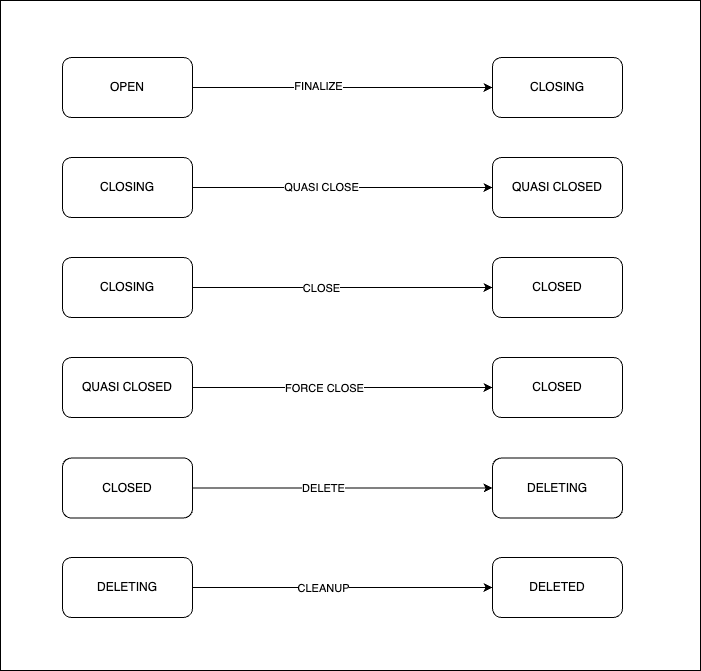

## Container State Flow
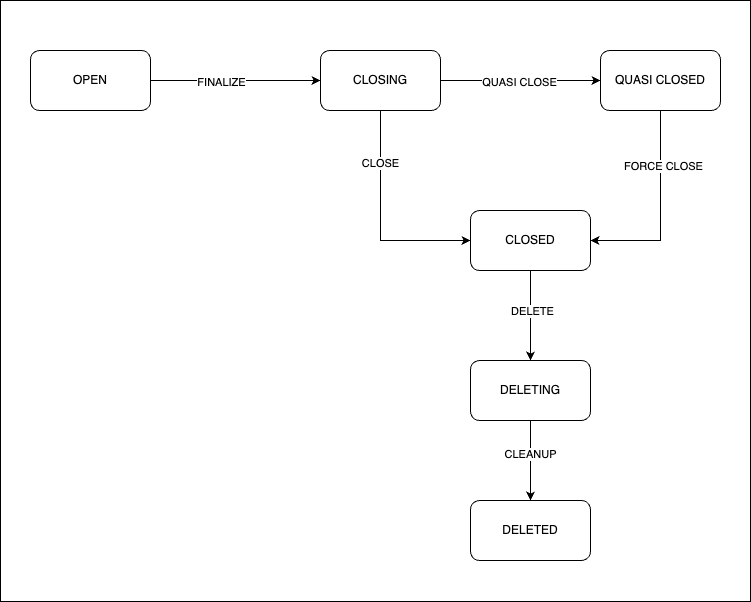

Container creation logic
Clients create the container. The containers are directly moved to OPEN state in SCM upon creation.
There is no allocated state for containers.

The number of `OPEN` containers in a pipeline is controlled by `ozone.scm.pipeline.owner.container.count`.

## Exercise
- Check the number of `OPEN` containers for a Pipeline in the cluster
```bash
ozone admin container info <containerId>
```

### Container file on Datanode
```bash
cat hdds/hdds/<Cluster ID>/current/containerDir0/1/metadata/1.container
```
### Why do we need `QUASI_CLOSED` state?
- When the container is not closed via Ratis, one of the replica could be lagging behind.

### How are `QUASI_CLOSED` containers closed?

Replication Manager will try to retain at least one replica per unique Origin Node ID.

# Block Management
## Block Allocation
- On Open Containers
- Sequence ID generator
- Only done on leader

## Block Deletion
- Sent only for closed containers
- The datanode marks the block for deletion and sends the ack
- Deletion ack should be received from all the replicas (three datanodes)

Note: Recent improvement is to send block delete command only if the contianer
has three healthy replicas.

There is a delete Block retry count. If the retry count exceeds the configured value,
SCM will not retry the block deletion.

### Get the number of pending transactions in SCM
```bash
ozone debug ldb --db=$scm_db_path scan --cf deletedBlocks --count
```

### How to reset the retry count for txns?
```bash
ozone admin scm deletedBlocksTxn reset
```

# Safemode

## Pre-check
- What is pre-check?
- What problem does pre-check logic solve?

## Container Safemode Rule
At least one replica of all the `CLOSED`/`QUASI_CLOSED` containers should be reported to SCM for this rule validation to succeed.

```bash
hdds.scm.safemode.threshold.pct
```
Default value is 0.99

## Datanode Safemode Rule
Configured number of datanodes should be registered with SCM for this rule validation to succeed.
```bash
hdds.scm.safemode.min.datanode
```
Default value is 1.
This Rule is part of pre-check.

## Healthy Pipeline Safemode Rule
This rule defines percentage of healthy pipelines need to be reported.
Once safe mode exit happens, this rules take care of writes can go
through in a cluster.

```bash
hdds.scm.safemode.healthy.pipeline.pct
```
Default value is 0.10

## One Replica Pipeline Safemode Rule
This rule covers whether we have at least one datanode is reported for each
open pipeline. This rule is for all open containers, we have at least one
replica available for read when we exit safe mode.

```bash
hdds.scm.safemode.atleast.one.node.reported.pipeline.pct
```
Default value is 0.90

## Safemode Behaviour
### OM Operations

| **Client Operation** | **Expected Behaviour** |
| --- | --- |
| Volume Create | Should Succeed. |
| Bucket Create | Should Succeed. |
| Volume List | Should Succeed. |
| Bucket List | Should Succeed. |
| Key/File List | Should Succeed. |
| Key/File Write | Should fail with Safemode Exception |
| Key/File Read | It should succeed if at least one DN holding the replica is registered. |

### SCM Admin Operations

| **Admin Command** | **Expected Behaviour** |
| --- | --- |
| Close Container | Should Succeed. The container will be moved to Closing state |
| CreatePipeline | Should fail with Safemode Exception |
| GetPipeline | Should Succeed. |

```bash
ozone admin safemode status --verbose
```
Check SCM Web UI for details.

### Problem
- Try to put cluster into safemode and verify the client commands.

# Disk Layout

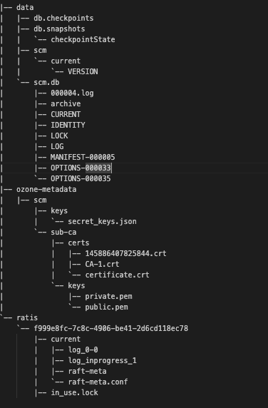

The version file
```bash
cat /data/metadata/scm/current/VERSION
```
Parse Raft Log file
```bash
ozone debug ratislogparser scm -s=/<Ratis Dir>/<Raft Group ID>/current/log_inprogress_1
```

# High Availability

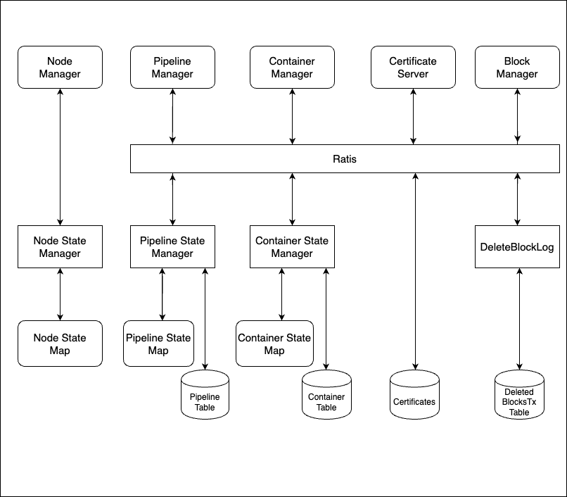

There is not much difference in HA and Non-HA code path in SCM. We have single node Ratis for Non-HA setup.

The Services run only on the leader SCM.
- Pipeline Creation Service
- Block Deletion Service
- Replication Manager

The SafemodeRules are executed locally on all the SCMs.
The Safemode state is not shared via Ratis.

Datanodes seen by SCMs might vary if there are network partitions.

# Decommissioning
Decommissioning is a process of removing a SCM from the cluster gracefully.
```bash
ozone admin scm decommission -nodeid=<nodeId>
```
Decommissioning command need Ratis quorum to succeed.

### Exercise
What happens if you remove node without decommissioning and add new SCM node?

# Recover from two SCM failure
- In case of two node failure, we have a potential dataloss as we don't have quorum anymore.
- Since there is no quorum, we cannot run decommission command.

We have to reconfigure this as single node Ratis Ring.

- Identify the SCM node peer id of the healthy SCM
```bash
cat /data/metadata/scm/current/VERSION
```
Verify this with the content from raft-meta.conf
```bash
cat /data/metadata/scm-ha/<Raft Group ID>/current/raft-meta.conf
```
Get the Peer ID
Stop the SCM service if it's running

Take a backup of the raft-meta.conf file

Run the below command to generate new raft-meta.conf file
```bash
ozone ratis local raftMetaConf -peers e54364cd-7453-41c1-bfdd-29365f269e7b\|scm1:9894 -path /data/metadata/scm-ha/f5591d01-4ca6-4ffe-ba28-73b051b8947c/current
```

Rename the new-raft-meta.conf file to raft-meta.conf
```bash
mv /data/metadata/scm-ha/f5591d01-4ca6-4ffe-ba28-73b051b8947c/current/new-raft-meta.conf /data/metadata/scm-ha/f5591d01-4ca6-4ffe-ba28-73b051b8947c/current/raft-meta.conf
```

Start the SCM service
```bash
ozone --daemon start scm
```

Check the status of the SCM service
```bash
ozone admin scm roles
```
Bootstrap two new SCM nodes to make it HA again.

Note:
Use Ratis log parser on Raft log to get idea on the last committed transaction on the healthy SCM.

# Datanode Heartbeat Protocol
